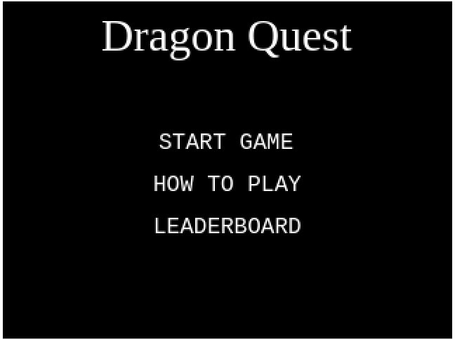
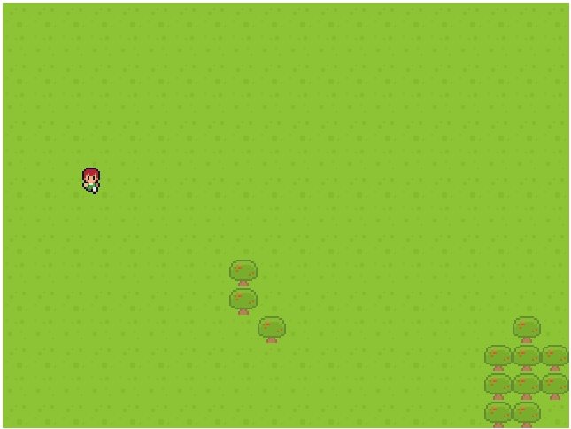
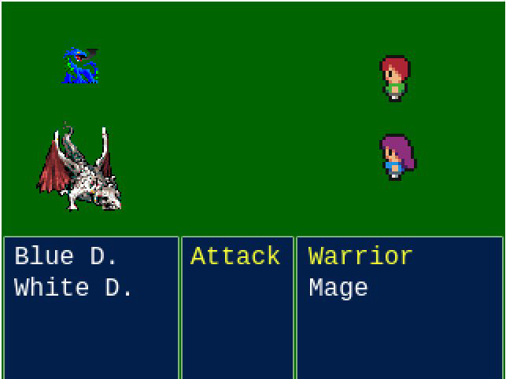

# capstone-js-phaser-rpg
A RPG Turn Based Game Build Using the Phaser Framework

## Content
* [Live Demo](#online-version)
* [Screenshots](#screenshots)
* [Features](#features)
* [Built With](#built-with)
* [Getting Start](#getting-start)
* [Tests](#testing)
* [Overview](#game-overview)
* [Contributing](#contributing)
* [Acknowledgments](#acknowledgments)
* [Author](#author)

## Screenshots


<br>

<br>


## Online Version
 [Live Demo ](https://agitated-rosalind-b151a5.netlify.app/)

## Features
<ul>
  <p>Any User Can:</p>
  <li>Check 'How To Play'</li>
  <li>Check 'LeaderBoard'</li>
  <li>Start a New Game, in which
    <ul>
      <li>Walk Around the World Map</li>
      <li>Battle Against Dragons</li>
      <li>Defeat Dragons</li>
      <li>Post Score (Automatically Posted)</li>
    </ul>
  </li>
</ul>

## Built With
- HTML5
- Javascript
- Webpack
- Phaser 3
- Jest
- ESLint (Linter) with Stickler (CI Tool)
- Git, Github and VScode
<br>

## Getting Start

#### Get a local copy
Now you need a copy of this application, if you are using Git:
```js
git@github.com:rsnazario/weather-app-js.git
```
Otherwise just hit (Download Zip) on green button (Clone or Download) at top of this page.

#### Run App

Since this project already provides the required files for setting up the Webpack, just type on your terminal:

```js
npm install
```

Now, you can just open your *Visual Studio Code* and click on `Go Live` if you have the `Live Server` extension installed properly. If it requires to select a folder to set as origin, make sure you choose `Dist` folder.

## Testing

After doing the `npm install`, all the the webpack depencies will be installed and with it will come the Jest Library.<br>
The test for this project is only applicable to functions that are not related to Phaser Framework, which leaves us with the task of testing the API connection only.<br>
Running the tests requires a simple use of the npm script, which triggers the Jest tool:

```js
npm test
```


## Game Overview

#### Intro
The goal of the game is to kill as much dragons as possible while playing this Turn Based Role Playing Game. It starts with two heroes against 4 types of dragons.<br>
The heroes are the Warrior (HP: 130 ATK: 12) and the Mage(HP: 80 ATK: 22). The dragons follows the same 'rule': the more the hp status, the less the damage inflicted.<br>
Once you encounter the enemies, the two enemy dragons will be randomly generated. Each Dragon defeated counts as +10 on your score!<br>
If any of the heroes goes bellow 40HP, it starts dealing double damage. After each fight, both heroes are healed in 12HP.<br>

#### Wold Map
The world map is a regular RPG Map, in which the player can walk around by using the <strong>Arrow Keys</strong>.<br>Around the map, there are about 40 invisible encounter-zones that will take you to battling! After the Battle Finishes, the player can start moving around again from the position that occurred the enemy encounter.<br>
In the World Map it is not possible to see the enemy encounter zones, which are randomly generated (Also, it's possible to start a game already in a battle if the encounter zone was generated at the Player's initial positioning).

#### Battling
The Game Follows the same old structure as the first released Final Fantasy Games. The Attack order will always be Heroes first than Enemies.<br>
On the Battle, The actions are chosen on Menus. The hero that will perform the attack is selected automatically when it is its turn and the actions are selected by choosing an option with UP and DOWN Arrow Keys and confirming it with SPACE or LEFT Arrow key.<br>
Actions Menu counts only with 'Attack' option so far, as it is first release of the Dragon Quest Game. Then, on enemies menu, choose which enemy you are going to attack!<br>
In the Battle, choose the actions and the enemy wisely in order to get the max score, since each dragon has different status.<br>

#### Future Features
As to improve the players best experience, there are some features to be added in the future. The most important ones are listed down here:<br>

<ul>
  <li>Magics and Mana Status:
    <ul>
      <li> Mage Deals Damage with Magic Only<li>
      <li> Add Damage Dealer Magics based on elements (Fire, Water, Thunder, Wind) and Healing Magics</li>
      <li> Mana Status and Mana Cost for Each Magic
    </ul>
  </li>
  <li>Adding Items to be used during Battle:
    <ul>
      <li>Healing Items</li>
      <li>Mana Restoring Items</li>
      <li>Effect Items</li>
    </ul>
  </li>
  <li>Leveling Up Characters</li>
</ul>

## Contributing

Contributions, issues and feature requests are welcome!

You can do it on [issues page](issues/).

## Acknowledgments

First of all, a special thanks for all Microverse Team and Code Reviewers that guides me through my learning.

For this project, I would like to say that I appreciate all help I had from:

- My Current Partner: [Martin Njoroge](github.com/kwizl)
- My Former Partner: [Thiago Miranda](github.com/Sevlamare)

## Author

👤 **Rafael Nazario**

- Github: [@rsnazario](https://github.com/rsnazario)
- Twitter: [@@rsnazario](https://twitter.com/@rsnazario)
- Linkedin: [Rafael Nazario](https://www.linkedin.com/in/rsnazario/)

## Show your support

Give a ⭐️ if you like this project!
